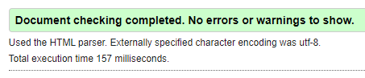
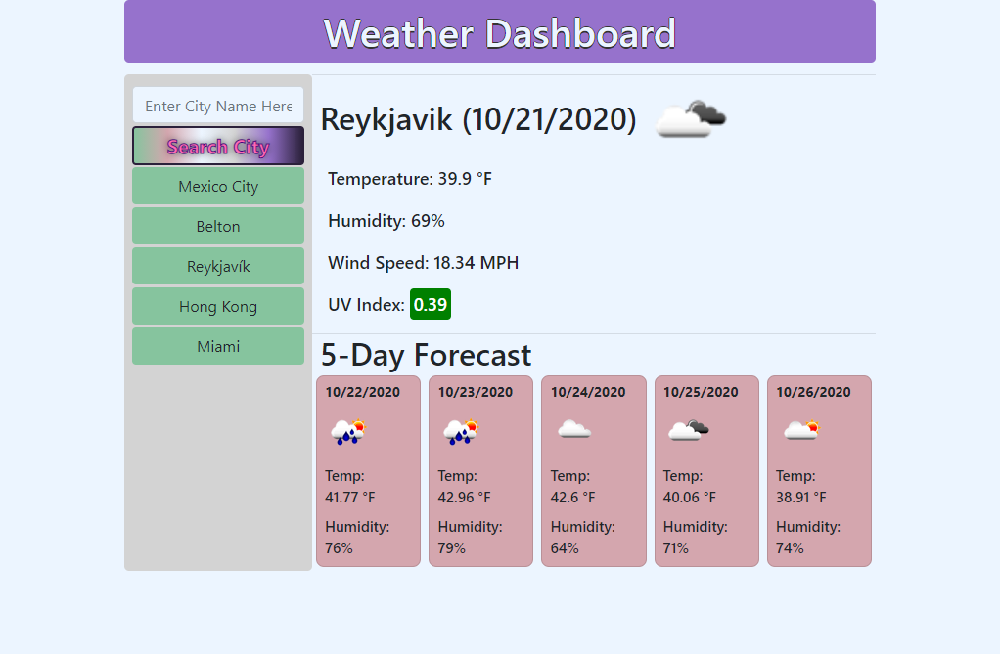

# [06-weather-dashboard](https://michellemcconville.github.io/06-weather-dashboard/) :link:

## Customer Request

For this project the customer requests a `5-Day Weather App`

---

## User Story

```.
AS A traveler
I WANT to see the weather outlook for multiple cities
SO THAT I can plan a trip accordingly
```

## Acceptance Criteria

```.
GIVEN a weather dashboard with form inputs
WHEN I search for a city
THEN I am presented with current and future conditions for that city and that city is added to the search history
WHEN I view current weather conditions for that city
THEN I am presented with the city name, the date, an icon representation of weather conditions, the temperature, the humidity, the wind speed, and the UV index
WHEN I view the UV index
THEN I am presented with a color that indicates whether the conditions are favorable, moderate, or severe
WHEN I view future weather conditions for that city
THEN I am presented with a 5-day forecast that displays the date, an icon representation of weather conditions, the temperature, and the humidity
WHEN I click on a city in the search history
THEN I am again presented with current and future conditions for that city
WHEN I open the weather dashboard
THEN I am presented with the last searched city forecast
```

---

## Sources Referenced

[google](https://www.google.com/) `|`
[momentJs](https://momentjs.com/) `|`
[w3schools](https://www.w3schools.com) `|`
[MDN web docs](https://developer.mozilla.org/en-US/) `|`
[Bootstrap](https://getbootstrap.com/) `|`
[Font Awesome](https://fontawesome.com/) `|`
[Markdown Guide](https://www.markdownguide.org/)

---

## Accessibility Standards Validation

| Successfully ran code thru [**W3C**](https://validator.w3.org/) validator |
|---------------------------------------------------------------------------|
|                         |

---

## Output for Review

Submitted the following for review:

- The URL of the deployed application
- The URL of the GitHub repository. (**README.md** included)

---

## Application Screenshot


